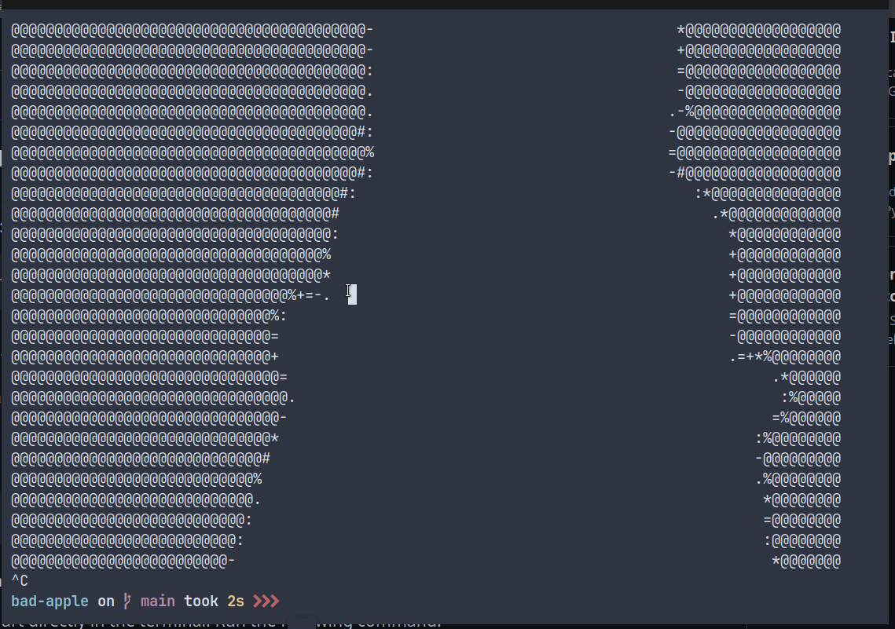

# Bad Apple For Terminal

This repository contains a set of scripts to convert the "Bad Apple" video into ASCII art representation and display it on terminal.

## Dependencies

- [FFmpeg (optional)](https://ffmpeg.org/): convert video to image frames.
- [Python](https://www.python.org/) (version 3.x) or bash.
- [Mpv](https://mpv.io/): A media player play audio background.
- [Ascii-image-converter (optional)](https://github.com/TheZoraiz/ascii-image-converter): convert image frame to text file.

## Usage

### 1. Converting the Video to ASCII Text (optional)

To convert the "Bad Apple" video (`bad_apple.mp4`) into ASCII art and save it into `frames-ascii` folder, run the following command:

```bash
sh make-ascii.sh
```

### 2. Running the ASCII Art

#### Python


```bash
python3 run.py
```

#### Bash


```bash
sh run.sh
```

## Acknowledgments

Idea from [this video](https://www.youtube.com/watch?v=B49nQu4L2O4)
